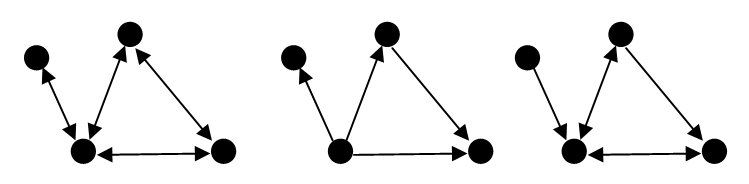
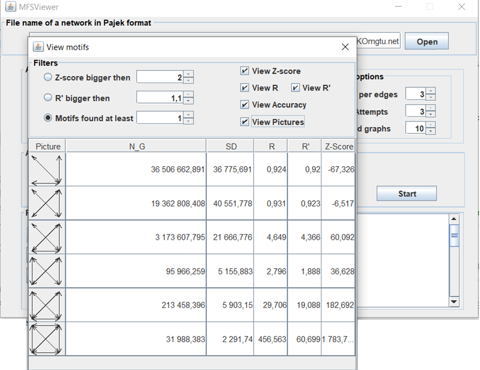

# 1 Introduction

MFSViewer is a tool for finding so-called networks motifs in a network, that is, it finds small vertex-induced subgraphs that occur significantly more often than in random networks. For a general introduction to the concept of network motifs. 
MFSViewer is able to search for network motifs of size three and four vertices in directed an undirected network. MFSViewer detects motifs by using the so-called MFS (Method of Frames Samling). More details on the MFS can be found in [1]. MFSViewer features a graphical interface for easy setup of algorithm parameters. 

The graphical interface and the help and the license of MFSViewer is similar FANMOD program [2]. But the logic of the MFS operation differs from FANMOD in speed, accuracy [3] and quality indicators of the obtained statistical estimates (such as unbias and efficiency). This can be found in more detail in my articles [1, 3] in English and [4, 5] in Russian. Now, finishing my PhD thesis I consider opportunity for publication in the journal with a high rating.

Even though this manual has become quite long by covering all the details, the use of MFSViewer should be quite intuitive. I have paid attention to giving all parameters sound default values, so if you wish to start detecting motifs right away the short introduction in Section 3 should be all you need. Whenever you want to tune the parameters, find out more about some details of the program, or if anything else remains unclear, please consult the more detailed sections:

* Section 4 deals with the algorithm parameters you can set before running the main algorithm.
* Section 5 details what happens when the algorithm is running and how it can be influenced.
* Section 6 provides details on how to view and process the results that are output by the main algorithm.
 

Fig. 1. The three areas of the main interface window of MFSViewer. They correspond to the three working steps when using the tool – setting up the algorithm, running the algorithm, and processing the results.

# 2 License

You may use MFSViewer for all of your research purposes as long as you do the following:
* You acknowledge its use in any published work that fully or in part derives its results from its usage. (If you wish to make a bibliographical reference, please consider citing one of my articles [1,4,5] for that purpose)
* You do not sell anything that is based on or derived from your use of MFSViewer.
Absolutely no guarantees or warranties are made concerning the suitability, correctness, or any other aspect of the distributed files. Any use is at your own risk.

# 3 Quick Start
This section describes the basic steps of a motif search without going too much into detail; I have tried to give all options in MFSViewer sound default values. Hence, this section is perfect for some first steps with MFSViewer – and for those who simply cannot wait to find their first motifs.

Fig. 2. The frames and buttons of the main window, named as they are referenced in the text.

Figure 1 shows the main window that appears when you start fanmod. The interface follows a top-down logic, i.e., the upper half is for setting the algorithm parameters and the lower half for running the algorithm and viewing/processing its results. A more detailed subdivision of these areas into frames is shown in Figure 2.

### 3.1 Selecting an Input Graph
The first step is to choose an input file that describes the network you would like to analyze. You can select this file within the input graph frame. MFSViewer allows you to load graphs in the Pajek format. If you want to process graphs in edgelist format you can use the console MFS program (https://github.com/MNYudina/MFS). MFSViewer can analyzed directed, undirected and mixed graph (see Figure 3). In any case graphs are reduced to simple graphs (multiple edges and loops are ignored).

 
Fig. 3. Analyzed undirected (left) and directed (center) and mixed graphs (right).
	
### 3.2 Setting the Options

The most important options of the motif search are in the algorithm options frame. Here you can choose the subgraph size (that is, the size of the motifs to be detected) and whether to perform a full enumeration of subgraphs or just sample some of them in the network. For information on sampling and the appropriate parameters, please refer to Section 4.2.
As motifs are detected by comparing their frequency of occurrence in the original network to their frequency of occurrence in a number of similar, yet randomized networks, you have to state how many random networks should be looked at and how they should be created. The number of randomized networks can be set in the number of networks box on the bottom of the random networks frame. An explanation of the other available options is deferred to Section 4.3.

### 3.3 Performing the Search

If you have followed the instructions of the previous subsections, you are now ready to start detecting network motifs. Simply click on the start button in the algorithm area of the program. The progress bars show the overall algorithm progress, the progress per network: numbers of subgraphs calculating process and randomization one. Get yourself a cup of coffee and wait until the program is done. But you will have less time to drink coffee than if you used other programs.

### 3.3 Viewing Results

Once the algorithm is completed, you can see some brief information about its run in the results box. The best way to get network motifs is clik on the View button to display a "View motifs"  window.

Fig. 4. The special window to view results of calculation

Results of calculation are follows

*  Picture of the motif
*  Statistical estimation number N_G of the motifs in an original network 
*  Standard deviation SD of a numbers of the motifs in an original network. You can use it to analyze calculation accuracy (for example, +/- 3SD is statistically-valid)
*  Statistical characteristics of the motifs (R, R', Z-score). For information on the characteristics, please refer to Section 6.

The "View motifs" allows setting filters using various criteria, as well as using sorting. The sorting is controlled by clicking on the column headers.

# 4 Algorithm Parameters	
This section covers the options which are available before starting a motif search.
They can all be found in the algorithm area of the main interface.

### 4.1 Subgraph Detection Options

#### Subgraph Size Input field

The size of the motifs to be searched is selected here. It may range from three up to four vertices. Be aware that although MFSViewer is quite fast, detecting 4-motifs may take very, very long. Also, you should have as much memory as possible available on your machine (use for it jvm peremeters).

#### Full Enumeration Radiobutton 

Choose this if you want all subgraphs (i.e., motif candidates) of the selected size to be counted/enumerated in the input network. This will ensure the most precise results but is of course slower than taking only a sample of subgraphs into account. 

#### Sampling count Radiobutton and Number of Samples Input field

If you choose this option, the algorithm will only sample a subset of all subgraphs in the network using MFS. Number of random frames (spanning tries realizations) is established by Number of Samples input field.

#### Use parallelism Checkbox

If you want to use the parallelization capabilities of JSR 335: Streams, then you should this option.

### 4.2 Random Network Options

MFSViewer has only one model od randomization. This model in the FANMOD named 'Local const', that is a default randomization model in the FANMOD and the only one which can be applied to undirected networks. In the model, unidirectional edges are only exchanged with unidirectional ones. The same applies for bidirectional edges. Therefore, the number of incident bidirectional edges remains locally constant, that is, it constant for each vertex. 

#### Number of Networks Input field

Here you set the number of random networks that are to be generated and analyzed in order to obtain a comparison to the original input network. The higher the number, the more accurate the results. But to search a random network takes approximately as long as searching the original input, so a high number requires more calculation time. As a general rule, consider increasing this number if there are a lot of motifs with undefined Z-Score among the results. 

#### Exchanges per edge Input field

When randomizing the network, the edges are exchanged one after the other. This number states how often the program walks over all the edges. Usually the default of three fits here, but if the results from the random networks are too similar to those of the original one, then you should increase this number.

#### Exchange attempts Input field

When it is an edge’s turn to be exchanged, an exchange partner edge is randomly selected from those edges that fulfil the desired properties (biderected/unidirected). For some reasons, this partner may not be suitable for the exchange (e.g., if both edges start at the same vertex, then an exchange would not change the network at all). In this case, another partner is selected. This is repeated until the exchange succeeds or the number of exchange attempts – which can be specified in this box – is exceeded. So, if too few exchanges succeed (the number of successful exchanges can be found in the results summary), this number should be increased. 

# 5 During the Search

### 5.1 The Status Bars

In the algorithm area, there are tree status bars which show accurately how far the search has progressed. The upper one gives you the total progress for all networks, the next ones show the progress of the network that is currently being processed. Middle status bar gives progress for subgraph counting process. Bottom one gives progress for randomization.

### 5.2 The Result Window

During the search, intermediate results – such as the number of vertices and edges in the input network, and the number of subgraphs that have been found in the original network – will appear in the results area. Once the search has been finished, a result overview is shown in this window. The detected subgraphs and statistics, though, can only be found in the output file.

# 6 Viewing the results

MFSViewer offers two ways to view results: Either you read the csv file directly (you can saved it by Save button), or you use the "View motifs" window.

### 6.1 The Values of the Result Table

The result table has the following columns:

* Motif ID. The Motif ID is characteristic non-negative integer for the motif  (i.e., motifs with the same ID are always isomorphic); The isomorphism class numbers correspond to the order used in the R program.
* N_G. The third column of the result table denotes the frequency with which a motif occurred in the original network.
* SD. The Standard deviation of a numbers of the motifs in an original network. You can use it to analyze calculation accuracy (for example, +/- 3SD is statistically-valid). If full enumeration is used then SD values equal 0.
* R. The R parameter is a ratio of the frequency in real network to the mean frequency in randomized networks as 

R = f_real/ E[f_rand]. 

It should be higher than 1.1 generally.

* R'. The R' parameter may be useful if we want to be assure that f_real> E(f_rand). Using MFS we can estimate accuracy of the calculation by using SD.The R' is a ratio of the frequency in real network – 3*E[SD_real] to the mean frequency in randomized networks +3*E[SD_rand]. So, 

R = (f_real– 3*SD_real )/ (E[f_rand]+ *E[SD_rand]).

It should be higher than 1 generally.

* Z-Score. The Z-Score is the original frequency minus the random frequency divided by the standard deviation. If you find an undefined value here, the standard deviation was zero. If there are a lot of undefined Z-Scores, consider generating more random networks or increasing the random parameters like exchanges per edge.

#### 6.2 Filters
The "View motifs" allows setting filters using various criteria
* View Z-score column;
* View R column;
* View R' column;
* View Accuracy (SD column);
* View Pictures or Motif ID.

The row sorting is controlled by clicking on the column headers.
In addition, you can display only those rows that satisfy a certain condition:
* Z-score is bigger then some value;
* R is bigger then some value;
* R' is bigger then some value.

### 6.3 In the CSV file
The csv file contains the output as produced by the core algorithm.
At the beginning of the file, the options of the search and properties of the input network are given, as well as the total number of subgraphs found and how long the search took. Then follows the result table which includes all the subgraphs found (no matter how rare or insignificant they were). The table is either human-readable or in csv. The csv format can easily be read by a spreadsheet application where you can sort, filter, or scan it for certain values.

### References
1. Yudina, M. N. Mixed Random Sampling of Frames method for counting number of motifs / M. N. Yudina, V. N. Zadorozhnyi, E. B. Yudin // Journal of Physics: Conference Series. – 2019. – V. 1260. – P. 022013.

2. S. Wernicke and F. Rasche. FANMOD: a tool for fast network motif detection. Bioinformatics, 22 (9):1152–1153, 2006
3. Yudina, M. N. Assessment of accuracy in calculations of network motif concentration by Rand ESU algorithm / M. N. Yudina // Journal of Physics: Conference Series. – 2019. – V. 1260. – P.022012.

4. Yudina, M.N. Analysis of bias and effectiveness of estimates of frequencies of occurrence of network motifs in statistical calculation methods / M.N. Yudina // Bulletin of cybernetics. - 2019.- T.36, No. 4. - S. 6–18. (in Russian)

5. Zadorozhny, V.N. Calculation of 4-motifs by the combined method of random frames sampling / V.N. Zadorozhny, M.N. Yudina // Bulletin of the Technological University. - 2019.- T.22, No. 11. - S. 122–127. (in Russian)
