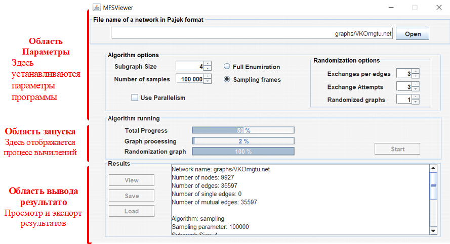
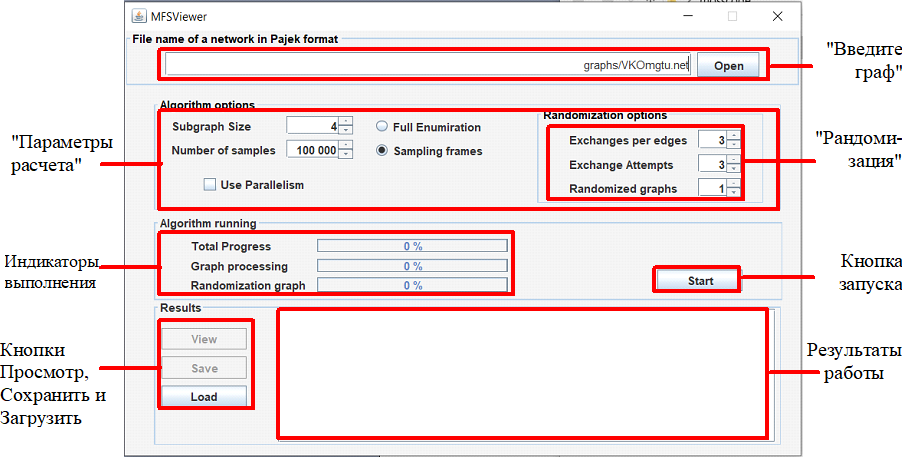
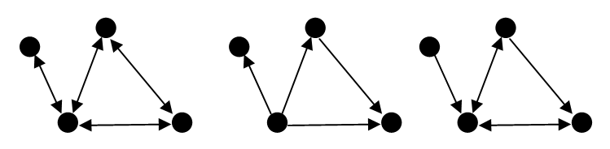
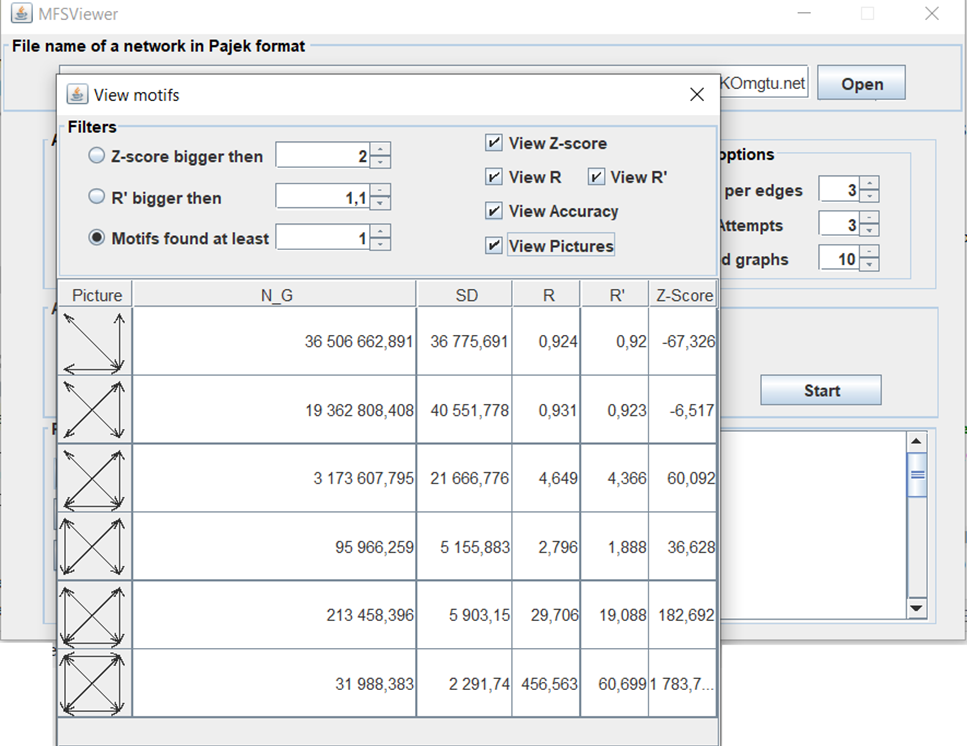

# Запустите MFSViewer.jar

# 1 Введение

Программа MFSViewer предназначенеа для выявления т.н. сетевых мотивов. Сетевые мотивы – это такие подграфы на заданном числе вершин, которые встрачаются в графе сети значительно чаще, чем в его рандомизированных версиях. 

Программа позволяет выявлять сетевые мотивы на трех и четыре вершинах в ориентированных, неориентированных и смешанных графах. Программа MFSViewer выявляет мотивы, используя метод расчета статистических оценок для частот встречаемости подграфов, который мы сейчас называем метод случайной выборки остовных деревьев. Ранее этот метод мы называли методом случайной выборки каркасов [1]. Программа MFSViewer имеет графический интерфейс, обеспечивающий возможность настройки параметров расчета. 

В качестве образца для подгражания для разработки графического интерфейса, выбора используемой лицензии и написания этого руководства использовались материалы самой популярной программы, используемой для тех же целей – программы FANMOD [2]. Но MFSViewer отличается от FANMOD по скорости работы, точности расчетов [3] и качественным показателям полученных статистических оценок для числа встречаемости мотивов (такими как несмещенность и эффективность). Это обсуждается в моих статьях  на английском [1, 3] и русском [4, 5] языках. Сейчас, завершая работу над своей диссертацией, я рассматриваю возможности написать статью в высокорейтенговом журнале.

Хотя это руководство довольно длинное, охватывая все детали, использование MFSViewer является интуитивно понятным. Кроме того, в программе все используемые параметры установлены по умолчанию, и этого может быть  достаточно, чтобы научиться обнаруживать мотивы в сетях прямо в процессе работы программы. Короткое введение в Разделе 3 - это все, что вам нужно. А всякий раз, когда вы хотите настроить параметры специально, узнать больше о некоторых деталях программы обратитесь следующим разделам руководства:

* Раздел 4 посвящен параметрам программы, которые вы можете установить перед запуском.
* Раздел 5 подробно описывает, что происходит, когда программа работает.
* Раздел 6 содержит подробную информацию о том, как просматривать и обрабатывать результаты вычислений.

 

Рис. 1. Три основные области интерфейса программы MFSViewer. Они соответствуют трем основным шагам при использовании программы - настройке, запуске и обработке результатов.

# 2 Лицензия

Вы можете использовать MFSViewer для всех своих исследовательских целей, если вы делаете следующее:

* Вы признаете его использование в любой опубликованной работе, которая полностью или частично получает результаты от ее использования (если вы хотите сделать библиографическую ссылку, пожалуйста, рассмотрите возможность цитирования одной из моих статей [1, 4, 5] для этой цели, либо более позднии версии)
* Вы не продаете ничего, что основано на использовании MFSViewer или является его производным.

Абсолютно никаких гарантий или гарантий относительно пригодности, правильности или любых других аспектов распространяемых файлов не предоставляется. Любое использование программы выполняется на свой страх и риск.

# 3 Быстрый старт

В этом разделе описываются основные этапы выявления сетевых мотивов, не вдаваясь в подробности. Я попыталась установить все параметры MFSViewer по умолчанию и этот раздел описывает некоторые первые шаги работы с MFSViewer для тех, кто просто не может дождаться, когда сможет найти свои первые сетевые мотивы.

Рис. 2. Описание панелей и кнопок главного окна программы.

На рисунке 1 показано главное окно MFSViewer, которое появляется при запуске программы. Интерфейс следует нисходящей логике, то есть верхняя половина предназначена для установки параметров алгоритма, а нижняя - для запуска алгоритма и просмотра / обработки его результатов. Более подробное подразделение этих областей на фреймы показано на рисунке 2.

### 3.1 Выбор исследуемого графа сети

Первый шаг - выбрать входной файл с графом, который описывает сеть, которую вы хотите проанализировать. Вы можете выбрать этот файл в панели «Введите граф». MFSViewer позволяет загружать графы в формате Pajek. Если вы хотите обрабатывать графы в формате Edgelist, вы можете использовать консольную программу MFS (https://github.com/MNYudina/MFS). Программа MFSViewer позволяет работать с  ориентированными, неориентированными и смешанными графами (см. Рис. 3). В любом случае графы сводятся к простым графам (кратные ребра и петли игнорируются).

 
 
Рис. 3. Примеры неориентированного (слева) и ориентированного (в центре) и смешанного простого графа (справа).
	
### 3.2 Настройка параметров

Наиболее важные параметры программы находятся на панели  «Параметры расчета». Здесь вы можете выбрать размер исследуемых подграфов (тем самым и размер обнаруживаемых мотивов) и указать, выполнять ли полный перебор подграфов или просто отбирать некоторые из них случайно методом случайного выбора остовных деревьев. 

Поскольку мотивы обнаруживаются путем сравнения их частоты появления в исходном графе с частотой их появления в рандомизированных версиях этого грфа, вы должны указать, сколько случайных таких рандомизированных графов следует анализировать и как их следует создавать. Количество рандомизированных графов может быть установлено в поле «Randomized graphs» в нижней части панели «Рандомизация». Объяснение других доступных опций отложено до Раздела 4.

### 3.3 Выполнение расчета
	
Если вы следовали инструкциям предыдущих подразделов, теперь вы готовы начать выявлять сетевые мотивы. Просто нажмите на кнопку запуска. Индикаторы выполнения показывают общий ход выполнения расчета, расчета очередного подграфа: как расчет встречаемости подграфов, так и процесс рандомизиции. Вам остается наполнить свою любимую чашку кофе и дожидаться окончания программы. В прочем у вас в этом случае остается меньше времени на кофе, чем если бы вы использовали другие программы.

### 3.3 Просмотр результатов

Как только программа завершит расчет, вы сможете увидеть краткую информацию о ходе его выполнения в окне «Результаты работы». Лучший способ закончить выявление сетевых мотивов – нажать на кнопку «Просмотр», открыв окно «Просмотр мотивов».

Рис. 4. Специальное окно для просмотра результатов расчета

Результаты расчета для каждого потенциального сетевого мотива следующие:

* изображение соответсвующего подграфа
* статистическая оценка для количества N_G реализаций мотива в исследуемом графе
* стандартное отклонение SD полученной статистической оценки (эта оценка рассматривается как нормально распределенная случайная величина). Вы можете использовать этот показатель для анализа точности расчета (например, +/- 3SD является статистически достоверным)
* статистические характеристики сетевых мотивов (R, R ', Z-оценка). Для получения информации о характеристиках, пожалуйста, обратитесь к разделу 6.

Окно «Просмотр мотивов» позволяет устанавливать фильтры по различным критериям, а также пользоваться сортировкой по полученным показателям. Сортировка выполняется нажатием на заголовки столбцов

# 4 Параметры алгоритма
В этом разделе описываются параметры, доступные до начала процесса выявления сетевых мотивов. Все они могут быть найдены на панели «Параметры расчета».

### 4.1 Параметры расчета частот встречаемости подграфов
	
#### Поле ввода Subgraph Size
Размер мотивов для поиска выбирается здесь. Этот размер может варьироваться от трех до четырех вершин. Имейте в виду, что хотя MFSViewer работает довольно быстро, обнаружение 4-х мотивов может занять очень много времени. Кроме того, у вас должно быть как можно больше доступной оперативной памяти на вашем компьютере (для увеличения доступной оперативной памяти используйте параметры jvm при запуске программы MFSViewer).

#### Переключатель Full Enumeration 

Выберите этот параметр, если хотите, чтобы все подграфы (то есть кандидаты в мотивы) выбранного размера были подсчитаны. Это обеспечит наиболее точные результаты, но, конечно, такой расчет будет значительно медленнее, чем получения статистических оценок для частот встречаемости подграфов.
	
#### Переключатель Sampling count and поля ввода Number of Samples 

Если вы выберете эту опцию, алгоритм будет расчитывать статистические оценки для частот встречаемости подграфов, используя метод случайного выбора остовных деревьев. Количество случайных выборов (реализаций остовных деревьев) определяется полем ввода Number of Samples.

#### Флажок Use parallelism 

Вам следует воспользоваться этой опцией, если вы хотите использовать возможности распараллеливания JSR 335: Streams.

### 4.2 Параметры рандомизации

Программа MFSViewer реализует только одну модель рандомизации. Эта модель в FANMOD называется «Local const». Эта модель рандомизации используется в FANMOD по умолчанию и единственная, которая может применяться к неориентированным графам. В модели однонаправленные ребра заменяются только однонаправленными. То же самое относится и к двунаправленным ребрам. Поэтому число падающих двунаправленных ребер остается локально постоянным, то есть постоянным для каждой вершины.

#### Поле ввода Number of Networks 

Здесь вы можете устанавить количество используемых в расчетах рандомизированных графов, которые должны быть сгенерированы и проанализированы, чтобы получить сравнение с исходным исследуемым графом сети. Чем выше число, тем точнее результаты. Но расчета встречаемости подграфов в каждом рандомизированном графе требуется примерно столько же времени, сколько и для расчета в исходном графе, поэтому для большого числа рандомизированных графов требуется больше времени. Как правило, следует увеличивать числа рандомизированных графов, если среди результатов много мотивов с неопределенным Z-score (+/– ∞).
	
#### Поле ввода Exchanges per edge 

При рандомизации сети ребра меняются один за другим. Это число указывает, как часто программа проходит все ребра. Обычно здесь используется значение по умолчанию, равное трем, но если результаты случайных сетей слишком похожи на результаты исходной сети, вам следует увеличить это число.

#### Поле ввода Exchange attempts 

Когда очередь подходит очередь обмена до некоторого ребра, партнер по обмену (другое ребро) выбирается случайным образом из тех ребер, которые удовлетворяют требуемым свойствам (двунаправленные / однонаправленные). По некоторым причинам этот партнер может не подходить для обмена (например, если оба ребра начинаются в одной и той же вершины, обмен вообще не изменит сеть). В этом случае выбирается другой партнер. Это повторяется до тех пор, пока обмен не будет успешным или число попыток обмена, которое можно указать в этом поле, будет превышено. Таким образом, если слишком мало обменов успешно, это число должно быть увеличено.

# 5 Процесс вычилений

### 5.1 Строки состояния
В Процесс вычилений присутсвуют три  строки состояния, которые показывают, как далеко продвинулся расчет. Верхняя строка состояния показывает общий прогресс вычислений, следующие две показывают прогресс при обработки отдельных графов. Средняя строка состояния отображает ход расчета частот встречаемости подграфов. Нижняя строка состояния показывает прогресс в процессе рандомизации.

### 5.2 Окно результатов

Во время поиска промежуточные результаты, такие как количество вершин и ребер исходного графа сети, время, которое было затрачено на процессы рандомизации и процессы расчетов частот встречаемости подграфов. После завершения процесса вычислений в этом окне отображается обзор результатов. Информация по обнаруженным подграфам содержится только в выходном файле.

# 6 Просмотр результатов

Программа MFSViewer предлагает два способа просмотра результатов: либо вы читаете файл CSV напрямую (вы можете сохранить его с помощью кнопки Сохранить), либо вы используете окно «Просмотр мотивов».

### 6.1 Значения таблицы результатов

Таблица результатов имеет следующие столбцы:

* Motif ID. Идентификатор подграфа Motif ID  представляет собой неотрицательное целое число задающее класс изоморфизма (подграфы с одинаковым идентификатором всегда изоморфны); Номера классов изоморфизмов соответствуют порядку, используемому в программе R.
* N_G. Второй столбец таблицы результатов обозначает частоту, с которой подграф встречался в исследуемом графе.
* SD. Стандартное отклонение для частоты встречаемости подграфов в исходной сети (если вы получаете статистические оценки для частоты встречаемости). Вы можете использовать его для анализа точности расчета (например, +/- 3SD является статистически достоверным). Если используется полное перечисление, то значения SD равны 0.
* R. Параметр R представляет собой отношение частоты встречаемости в исследуемом графе к средней частоте встречаемости в рандомизированных сетях 

R = f_real/ E[f_rand]. 

Считается, что у сетевых мотивов R должно быть выше 1,1.

* R '. Параметр R 'может быть полезен, если мы хотим убедиться, что f_real> E (f_rand). Используя MFS, мы можем оценить точность расчета с помощью SD. R '- это отношение частоты встречаемости подграфа в исследуемом графе - 3 * E [SD_real] к средней частоте в рандомизированных сетях + 3 * E [SD_rand:

R = (f_real– 3 * SD_real) / (E [f_rand] + * E [SD_rand]).

Для сетевых мотивов этот параметр должен быть больше 1.

* Z-Score - стандартизованная оценка, это показатель, который вычисляется как разность частоты встречаемости подграфа в исследуемом графе и средней частоты встречаемости в рандомизированных графах, и эта разность делится на стандартное отклонение, вычисленное по частотам встречаемости подграфа полученных с использованием рандомизированных графов. Неопределенное значение Z-Score будет, когда стандартное отклонение будет равно нулю. Если существует много неопределенных значений Z-Score, рассмотрите возможность увеличения числа рандомизированных графов или увеличения случайных параметров.

### 6.2 Фильтры

Окно «Просмотр мотивов» позволяет устанавливать фильтры по различным критериям.

* По значениям столбца Z-Score;
* По значениям столбца R ;
* По значениям столбца R';
* По точности расчетов (колонка SD);
* Позволяет выводить либо изображения подграфов, либо их номера классов изоморфизма.
	
Сортировка строк может быть выполнена нажатием на заголовки столбцов. 

Кроме того, вы можете отображать только те строки, которые удовлетворяют определенному условию:
* отобразить только подграфы со значениями Z-Score больше заданного;
* отобразить только подграфы со значениями R больше заданного;
* отобразить только подграфы со значениями R' больше заданного.

### 6.3 Содержания *.CSV файла

Файл *.CSV содержит выходные данные, полученные с помощью выполнения расчетов.
В начале файла указываются параметры поиска и свойства входной сети и продолжительность поиска. Затем следует таблица результатов, которая включает все найденные подграфы (независимо от того, насколько они редки или незначительны). Формат CSV может быть легко прочитан приложением электронных таблиц, где вы можете сортировать, фильтровать или сканировать его для определенных значений.

По всем вопросам обращаться через аккаунт   https://www.researchgate.net/profile/Maria_Yudina2

# Используемая литература

1. Yudina, M. N., Zadorozhnyi V. N., Yudin E. B. Mixed Random Sampling of Frames method for counting number of motifs / M. N. Yudina, // Journal of Physics: Conference Series. – 2019. – V. 1260. – P. 022013.

2. Wernicke S. and Rasche F. FANMOD: a tool for fast network motif detection. Bioinformatics, 22 (9):1152–1153, 2006.

3. Yudina M. N. Assessment of accuracy in calculations of network motif concentration by Rand ESU algorithm // Journal of Physics: Conference Series. – 2019. – V. 1260. – P.022012.

4. Юдина М.Н. Анализ несмещенности и эффективности оценок частот встречаемости сетевых мотивов в статистических методах расчета // Вестник кибернетики. – 2019. – Т.36, № 4. – С. 6–18. 

5. Задорожный В.Н., Юдина М.Н. Расчет сетевых мотивов комбинированным методом случайной выборки каркасов // Вестник технологического университета. – 2019. – Т.22, № 11. – С. 122–127.
